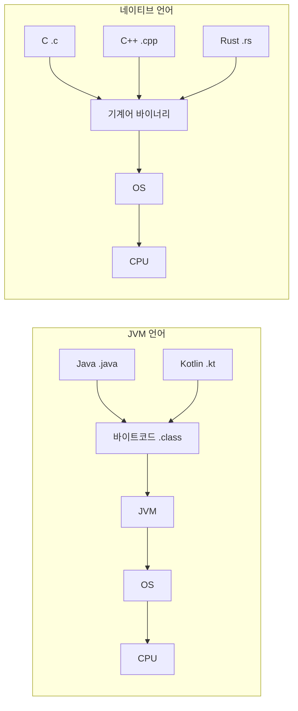
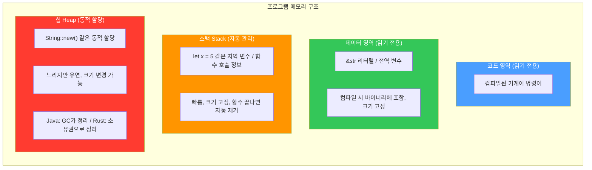

# Study-Rust

Rust 학습 저장소 (The Rust Programming Language 기반)

---

## Rust는 왜 만들어졌는가?

C/C++은 OS에 직접 접근할 수 있는 시스템 프로그래밍 언어지만, 메모리를 개발자가 직접 관리해야 한다.
이로 인해 use-after-free, 이중 해제, 버퍼 오버플로우 같은 메모리 버그가 빈번하게 발생했다.
(Microsoft, Google 발표 기준 보안 취약점의 약 70%가 메모리 관련)

Rust는 **C/C++의 성능은 유지하면서, 소유권(Ownership) 시스템으로 컴파일 시점에 메모리 안전성을 보장**하기 위해 만들어졌다.

---

## 실행 방식 비교

| 방식 | 설명 | 언어 |
|------|------|------|
| 인터프리터 | 코드를 한 줄씩 읽으며 실행 | Python |
| JIT 컴파일 | 실행 중 자주 쓰는 코드를 기계어로 변환 | Java, Kotlin, JavaScript |
| AOT 컴파일 | 실행 전에 미리 전부 기계어로 변환 | C, C++, Rust |



- Rust/C/C++은 컴파일하면 **네이티브 바이너리**가 나온다. JVM 같은 런타임 없이 OS 위에서 바로 실행된다.
- Java/Kotlin은 JVM이 필요하다. 대신 JVM 덕분에 어떤 OS에서든 같은 코드로 실행 가능 (Write Once, Run Anywhere).
- Rust 바이너리는 OS 종속적이다. macOS에서 빌드하면 macOS에서만 실행 가능.

---

## OS 접근 구조

| | Rust / C / C++ | Java / Kotlin |
|---|---|---|
| 구조 | 코드 → OS | 코드 → JVM → OS |
| 메모리 관리 | 직접 제어 (Rust: 소유권) | GC(가비지 컬렉터) |
| OS API 호출 | 직접 가능 | JVM을 통해 간접 접근 |
| 컴파일 결과 | 네이티브 바이너리 | 바이트코드 (.class) |

---

## Rust 메모리 관리 vs Java

### 메모리 영역 구조

프로그램이 실행되면 OS가 메모리를 영역별로 나눠준다:



```rust
let x = 5;               // 스택에 저장
let s1 = "hello";        // &str → 데이터 영역 (읽기 전용, 변경 불가)
let s2 = String::new();  // String → 힙 (변경 가능, 소유자가 정리)
```

### 데이터 영역 vs 스택 구분 기준

핵심 차이는 **언제 값이 결정되느냐**이다.

| | 데이터 영역 | 스택 |
|---|---|---|
| 값 결정 시점 | 컴파일 시 | 런타임(실행 중) |
| 생명주기 | 프로그램 시작~끝까지 유지 | 함수 시작~끝까지 유지 |
| 예시 | 문자열 리터럴, 전역 상수 | 지역 변수 |

```rust
const MAX: i32 = 100;       // 데이터 영역 (전역 상수, 프로그램 내내 존재)

fn foo() {
    let s = "hello";         // "hello" 자체는 데이터 영역 (컴파일 시 이미 결정)
                             // s (포인터)는 스택 (지역 변수)
    let x = 5;               // 스택 (지역 변수)
    let y = x + 10;          // 스택 (런타임에 계산)
}   // 함수 끝나면 s, x, y 스택에서 제거
    // "hello"는 데이터 영역에 그대로 남아있음
```

- **데이터 영역** → 코드에 직접 박아놓은 값 (실행파일에 포함됨)
- **스택** → 함수 안에서 만들어지는 변수들
- 스택은 Java, Rust, C 모두 OS가 동일한 방식으로 관리한다. 차이는 **힙**에서만 발생한다.

### String Pool이 없는 이유

- Java: `"hello"`를 여러 번 써도 String Pool에서 같은 객체를 공유 (JVM + GC가 관리)
- Rust: 모든 값에 명확한 **소유자가 1명**이어야 함 (소유권 원칙)
  - 문자열을 공유하면 소유자가 모호해지므로 String Pool과 맞지 않음
  - 대신 두 가지 문자열 타입으로 구분:

| | `&str` | `String` |
|---|---|---|
| 위치 | 데이터 영역 (바이너리 내부) | 힙 |
| 변경 | 불변 | 가변 |
| 용도 | 고정 텍스트 | 동적 텍스트 |

### 힙 메모리 정리 방식


---

## Rust가 Java/Kotlin보다 유리한 영역

| 영역 | GC 문제 | Rust |
|------|---------|------|
| 게임 엔진 | GC 때문에 프레임 드랍 | 멈춤 없이 일정한 성능 |
| 실시간 시스템 | 지연 발생 허용 불가 | 예측 가능한 성능 |
| OS / 드라이버 | JVM 자체를 올릴 수 없음 | 네이티브로 가능 |
| 임베디드 | 메모리 부족으로 JVM 불가 | 작은 바이너리 가능 |
| WebAssembly | JVM을 브라우저에 올릴 수 없음 | Wasm으로 컴파일 가능 |

---

## Cargo (빌드 도구)

Cargo는 Rust의 빌드 시스템 + 패키지 매니저이다. Java/Kotlin의 **Gradle**에 해당한다.

| Java/Kotlin | Rust |
|---|---|
| Gradle | Cargo |
| `build.gradle` | `Cargo.toml` |
| Maven Central | crates.io |
| `./gradlew build` | `cargo build` |
| `./gradlew run` | `cargo run` |
| `./gradlew test` | `cargo test` |

### 저장소 관리 주체

- Maven Central → Sonatype (미국 회사)
- crates.io → Rust Foundation (AWS, Google, Microsoft 등이 후원하는 비영리 재단)

### 로컬 캐시 경로 (macOS)

- Maven → `~/.m2/repository/`
- Cargo → `~/.cargo/registry/`

---

## 기본 문법

### 변수 선언

```rust
let x = 5;       // 불변 (Kotlin의 val)
let mut y = 5;   // 가변 (Kotlin의 var)
```

### 함수 선언

```rust
fn main() {}     // fn = 함수 선언 키워드 (Kotlin의 fun)
```

### 매크로 vs 함수

```rust
println!("hello")  // ! 있으면 매크로
// println("hello") // ! 없으면 함수 (이 함수는 존재하지 않음)
```

---

## 프로젝트 구조

```
Study-Rust/
├── hello_world/        # rustc로 직접 컴파일하는 예제
├── hello_cargo/        # cargo new로 생성한 프로젝트
└── guessing_game/      # 숫자 맞추기 게임 (Chapter 2)
    ├── Cargo.toml
    └── src/
        └── main.rs
```
