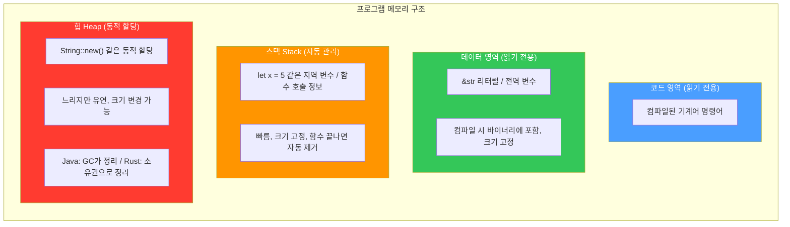
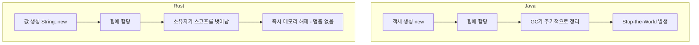

# Rust 메모리 관리 vs Java

## 메모리 영역 구조

프로그램이 실행되면 OS가 메모리를 영역별로 나눠준다:



```rust
let x = 5;               // 스택에 저장
let s1 = "hello";        // &str → 데이터 영역 (읽기 전용, 변경 불가)
let s2 = String::new();  // String → 힙 (변경 가능, 소유자가 정리)
```

---

## 데이터 영역 vs 스택 구분 기준

핵심 차이는 **언제 값이 결정되느냐**이다.

| | 데이터 영역 | 스택 |
|---|---|---|
| 값 결정 시점 | 컴파일 시 | 런타임(실행 중) |
| 생명주기 | 프로그램 시작~끝까지 유지 | 함수 시작~끝까지 유지 |
| 예시 | 문자열 리터럴, 전역 상수 | 지역 변수 |

```rust
const MAX: i32 = 100;       // 데이터 영역 (전역 상수, 프로그램 내내 존재)

fn foo() {
    let s = "hello";         // "hello" 자체는 데이터 영역 (컴파일 시 이미 결정)
                             // s (포인터)는 스택 (지역 변수)
    let x = 5;               // 스택 (지역 변수)
    let y = x + 10;          // 스택 (런타임에 계산)
}   // 함수 끝나면 s, x, y 스택에서 제거
    // "hello"는 데이터 영역에 그대로 남아있음
```

- **데이터 영역** → 코드에 직접 박아놓은 값 (실행파일에 포함됨)
- **스택** → 함수 안에서 만들어지는 변수들
- 스택은 Java, Rust, C 모두 OS가 동일한 방식으로 관리한다. 차이는 **힙**에서만 발생한다.

---

## String Pool이 없는 이유

- Java: `"hello"`를 여러 번 써도 String Pool에서 같은 객체를 공유 (JVM + GC가 관리)
- Rust: 모든 값에 명확한 **소유자가 1명**이어야 함 (소유권 원칙)
  - 문자열을 공유하면 소유자가 모호해지므로 String Pool과 맞지 않음
  - 대신 두 가지 문자열 타입으로 구분:

| | `&str` | `String` |
|---|---|---|
| 위치 | 데이터 영역 (바이너리 내부) | 힙 |
| 변경 | 불변 | 가변 |
| 용도 | 고정 텍스트 | 동적 텍스트 |

---

## 힙 메모리 정리 방식


