# C vs Rust vs Kotlin: 다형성의 원리

## 다형성이란?

"같은 호출 방식으로 다른 동작을 실행하는 것"

```
speak() 호출
  ├─ Dog  → "멍멍!"
  ├─ Cat  → "야옹~"
  └─ Duck → "꽥꽥!"
```

타입마다 다른 함수가 실행되어야 한다. 이걸 어떻게 구현하느냐가 핵심이다.

---

## vtable이란?

**Virtual Method Table**의 줄임말. "함수 주소를 모아놓은 표"다.

### 문제 상황

```
Animal 타입의 변수 a가 있다.
a.speak()을 호출했다.
그런데 a가 Dog인지 Cat인지는 런타임에만 알 수 있다.
→ 어떤 speak()을 호출해야 하는가?
```

### 해결: 함수 주소를 표로 만들어두자

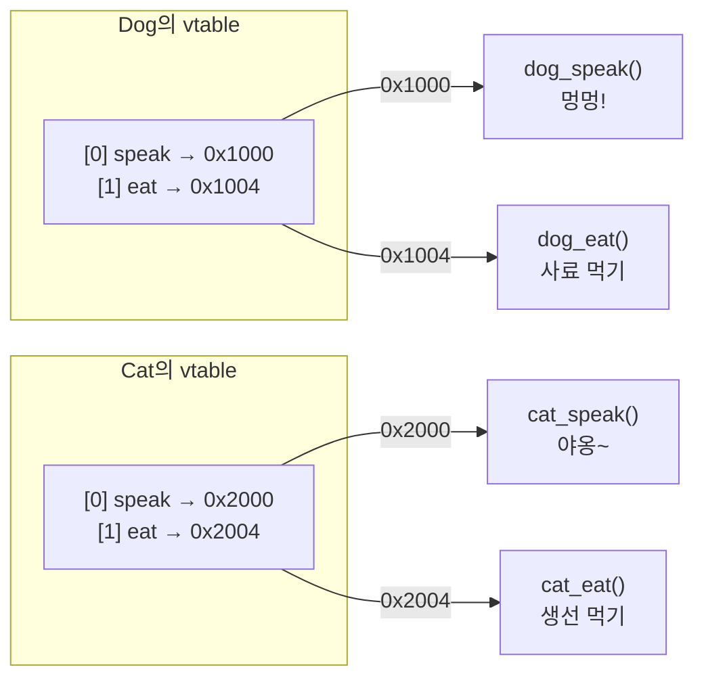

각 타입마다 vtable이 하나씩 존재한다. vtable 안에는 해당 타입의 메서드들의 **메모리 주소**가 순서대로 들어있다.

### 호출 과정

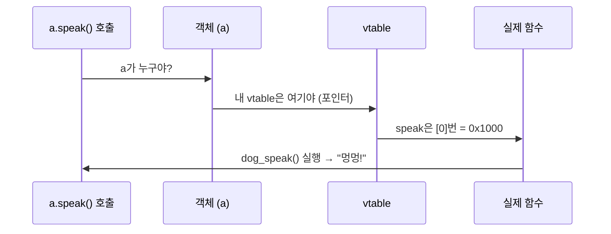

1. 객체에게 "너의 vtable 어딨어?" 물어봄
2. vtable에서 "speak은 몇 번째?" 찾음
3. 그 주소에 있는 함수를 실행

### 메모리 배치

```
Dog 객체                          Dog vtable
┌──────────────────┐             ┌──────────────────────┐
│ vtable_ptr: ─────┼────────────→│ [0] speak: 0x1000    │──→ dog_speak()
│ name: "바둑이"    │             │ [1] eat:   0x1004    │──→ dog_eat()
└──────────────────┘             └──────────────────────┘

Cat 객체                          Cat vtable
┌──────────────────┐             ┌──────────────────────┐
│ vtable_ptr: ─────┼────────────→│ [0] speak: 0x2000    │──→ cat_speak()
│ name: "나비"      │             │ [1] eat:   0x2004    │──→ cat_eat()
└──────────────────┘             └──────────────────────┘
```

핵심: **객체 안에 vtable 포인터가 숨어있다.** 이 포인터가 자기 타입의 함수 목록을 가리킨다.

### 각 언어에서 vtable을 누가 만드는가?

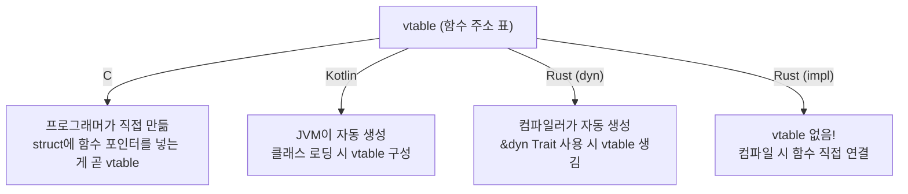

### vtable의 비용

vtable을 사용하면 함수 호출마다 **간접 참조(indirection)**가 발생한다.

```
직접 호출:     dog_speak()          → 1단계
vtable 호출:   객체 → vtable → 함수  → 2단계 (포인터 2번 따라감)
```

이 비용은 작지만, 초당 수백만 번 호출되는 코드에서는 차이가 난다.
Rust가 `&impl Trait`(정적 디스패치)를 기본으로 하는 이유가 이것이다.
vtable이 필요 없으면 아예 만들지 않는다.

---

## Rust에서 trait은 struct가 아니다

trait은 데이터가 없는 **계약(자격증)**이다. 실제 데이터는 struct에 있다.

```rust
trait Animal {         // 계약만 정의. 데이터 없음.
    fn speak(&self);
}

struct Dog { name: String }  // 데이터
struct Cat { name: String }  // 데이터
struct Rock;                 // 데이터

impl Animal for Dog { ... }  // Dog에 Animal 자격 부여 → vtable 생성
impl Animal for Cat { ... }  // Cat에 Animal 자격 부여 → vtable 생성
// Rock은 구현 안 함          // 자격 없음 → vtable 없음 → &dyn Animal로 사용 불가
```

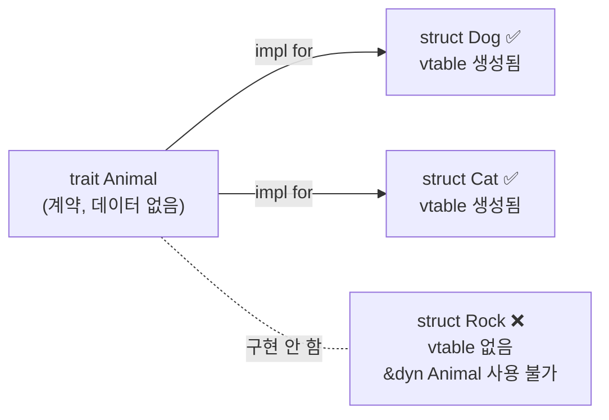

`impl Animal for X`를 하지 않은 타입은 `&dyn Animal`로 받을 수 없다. 컴파일 에러가 난다.
이것이 Rust의 안전성: **vtable에 등록되지 않은 타입은 런타임에 도달할 수 없다.**

---

## trait의 3가지 역할

trait은 다형성만을 위한 것이 아니다. 하나의 도구로 3가지 역할을 한다.

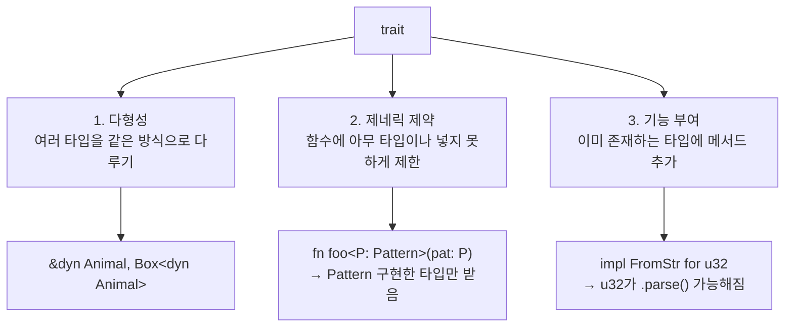

다른 언어에서는 interface, 제네릭 제약, 확장 함수가 별개인데, Rust는 trait 하나로 전부 처리한다.

---

## `&impl Trait` vs `&dyn Trait`

둘 다 "trait을 구현한 타입을 받겠다"이지만, **타입을 언제 결정하느냐**가 다르다.

### `&impl Trait` — 컴파일 타임에 결정 (정적 디스패치)

```rust
fn interact(a: &impl Animal) {
    a.speak();
}

interact(&dog);  // 컴파일러가 Dog 전용 함수 생성
interact(&cat);  // 컴파일러가 Cat 전용 함수 생성
```

```
컴파일 후:
interact_dog(a: &Dog) { ... }  ← Dog 전용, dog_speak() 직접 호출
interact_cat(a: &Cat) { ... }  ← Cat 전용, cat_speak() 직접 호출

→ vtable 없음. 비용 0. 대신 바이너리 크기 커짐.
```

### `&dyn Trait` — 런타임에 결정 (동적 디스패치)

```rust
fn interact(a: &dyn Animal) {
    a.speak();
}

interact(&dog);  // 런타임에 Dog vtable 조회
interact(&cat);  // 런타임에 Cat vtable 조회
```

```
컴파일 후:
interact(a: &dyn Animal) { ... }  ← 함수 1개, vtable 조회 코드 포함

→ vtable 조회 비용 있음. 대신 바이너리 작음.
```

### `&dyn`만 가능한 것: 서로 다른 타입을 한 컬렉션에 담기

```rust
// &impl은 불가능 - Dog과 Cat은 다른 타입
let animals: Vec<&impl Animal> = vec![&dog, &cat];  // ❌ 컴파일 에러

// &dyn은 가능 - vtable을 통해 런타임에 구분
let animals: Vec<&dyn Animal> = vec![&dog, &cat];   // ✅
for a in &animals {
    a.speak();  // 각각의 vtable을 따라감
}
```

### 비교

| | `&impl Trait` | `&dyn Trait` |
|---|---|---|
| 타입 결정 | 컴파일 타임 | 런타임 |
| vtable | 없음 | 있음 |
| 성능 | 빠름 (직접 호출) | 약간 느림 (간접 호출) |
| 여러 타입 섞기 | 불가능 | 가능 |
| 바이너리 크기 | 커짐 (타입별 함수 복사) | 작음 (함수 하나) |

---

## Rust trait의 3가지 장점 요약

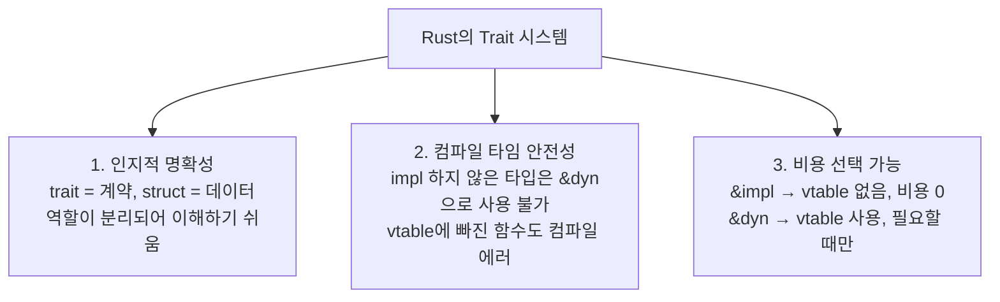

---

## 전체 구조 비교

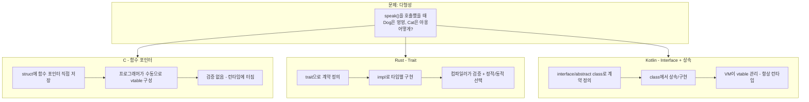

---

## 각 언어의 구현 방식

### C - 함수 포인터 (수동)

```c
// 함수 포인터 테이블 = 수동 vtable
typedef struct {
    const char* name;
    void (*speak)(void);
    void (*eat)(void);
} Animal;

void dog_speak() { printf("멍멍!\n"); }
void dog_eat()   { printf("사료 먹기\n"); }

Animal dog = { "강아지", dog_speak, dog_eat };
dog.speak();  // 함수 포인터를 통해 호출
```

### Rust - Trait (컴파일러가 관리)

```rust
trait Animal {
    fn speak(&self);
    fn eat(&self);
}

struct Dog { name: String }

impl Animal for Dog {
    fn speak(&self) { println!("멍멍!"); }
    fn eat(&self)   { println!("사료 먹기"); }
}
```

### Kotlin - Interface

```kotlin
interface Animal {
    fun speak()
    fun eat()
}

class Dog(val name: String) : Animal {
    override fun speak() = println("멍멍!")
    override fun eat()   = println("사료 먹기")
}
```

---

## 메모리에서 실제로 일어나는 일

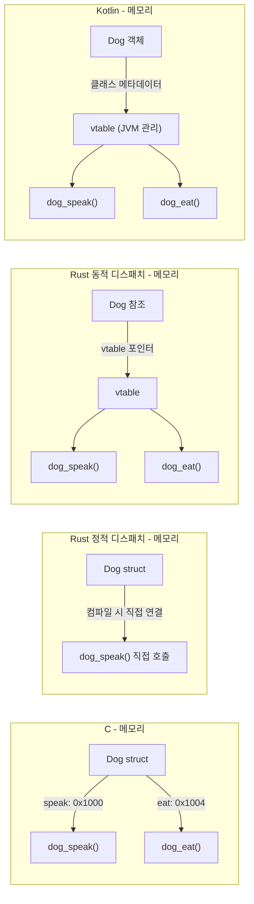

---

## 디스패치 방식 비교

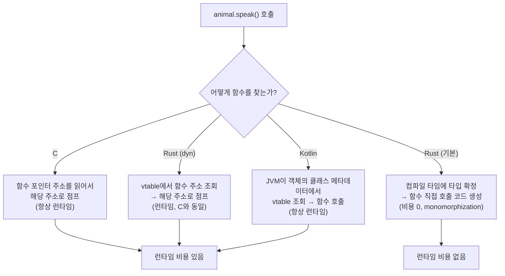

---

## Rust의 정적 vs 동적 디스패치

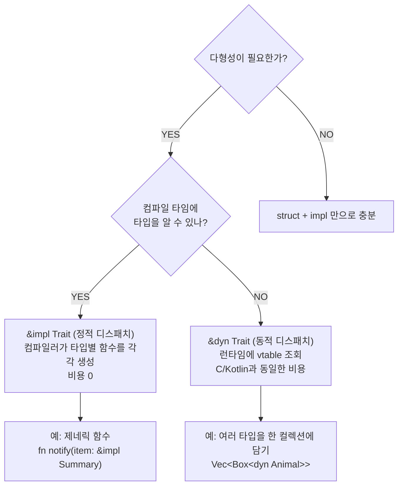

---

## 안전성 비교

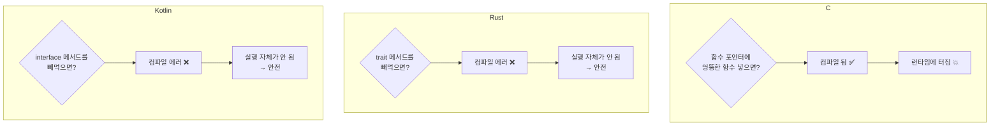

---

## 상속 vs 합성

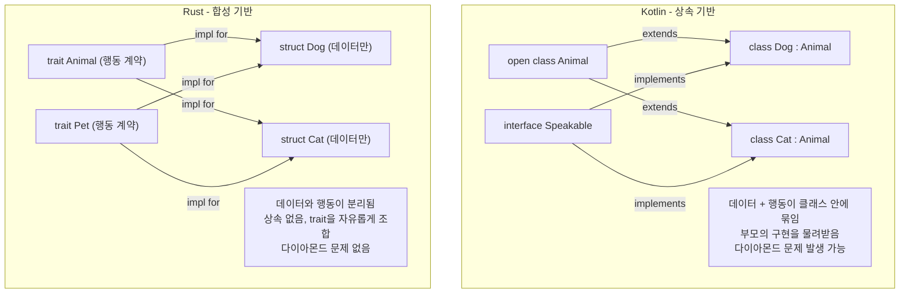

---

## 최종 비교표

| | C | Rust | Kotlin |
|---|---|---|---|
| **다형성 도구** | 함수 포인터 | trait | interface + 상속 |
| **vtable 관리** | 프로그래머 | 컴파일러 | JVM |
| **컴파일 타임 검증** | 없음 | 있음 | 있음 |
| **정적 디스패치** | 수동으로 가능 | `&impl Trait` | 없음 (JIT가 최적화) |
| **동적 디스패치** | 항상 | `&dyn Trait` | 항상 |
| **상속** | 없음 | 없음 | 있음 |
| **런타임 비용** | 함수 포인터 조회 | 선택 가능 (0 또는 조회) | JVM 오버헤드 |
| **메모리 관리** | 수동 (malloc/free) | 소유권 시스템 (자동) | GC |

---

## 한 줄 요약

> **밑바닥은 전부 vtable(함수 포인터 테이블)이다.**
>
> - **C**: 직접 만들고 직접 관리. 빠르지만 위험.
> - **Kotlin**: JVM이 만들고 JVM이 관리. 안전하지만 항상 런타임 비용.
> - **Rust**: 컴파일러가 만들고 검증. 안전하면서 비용도 선택 가능 (정적이면 0).
