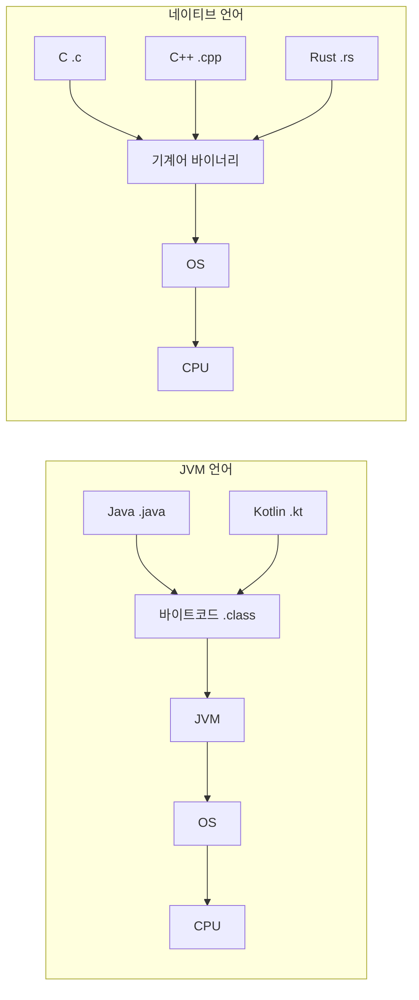

# Rust는 왜 만들어졌는가?

## 배경

C/C++은 OS에 직접 접근할 수 있는 시스템 프로그래밍 언어지만, 메모리를 개발자가 직접 관리해야 한다.
이로 인해 use-after-free, 이중 해제, 버퍼 오버플로우 같은 메모리 버그가 빈번하게 발생했다.
(Microsoft, Google 발표 기준 보안 취약점의 약 70%가 메모리 관련)

Rust는 **C/C++의 성능은 유지하면서, 소유권(Ownership) 시스템으로 컴파일 시점에 메모리 안전성을 보장**하기 위해 만들어졌다.

---

## 실행 방식 비교

| 방식 | 설명 | 언어 |
|------|------|------|
| 인터프리터 | 코드를 한 줄씩 읽으며 실행 | Python |
| JIT 컴파일 | 실행 중 자주 쓰는 코드를 기계어로 변환 | Java, Kotlin, JavaScript |
| AOT 컴파일 | 실행 전에 미리 전부 기계어로 변환 | C, C++, Rust |

- Rust/C/C++은 컴파일하면 **네이티브 바이너리**가 나온다. JVM 같은 런타임 없이 OS 위에서 바로 실행된다.
- Java/Kotlin은 JVM이 필요하다. 대신 JVM 덕분에 어떤 OS에서든 같은 코드로 실행 가능 (Write Once, Run Anywhere).
- Rust 바이너리는 OS 종속적이다. macOS에서 빌드하면 macOS에서만 실행 가능.

---

## OS 접근 구조

| | Rust / C / C++ | Java / Kotlin |
|---|---|---|
| 구조 | 코드 → OS | 코드 → JVM → OS |
| 메모리 관리 | 직접 제어 (Rust: 소유권) | GC(가비지 컬렉터) |
| OS API 호출 | 직접 가능 | JVM을 통해 간접 접근 |
| 컴파일 결과 | 네이티브 바이너리 | 바이트코드 (.class) |

---

## Rust가 Java/Kotlin보다 유리한 영역

| 영역 | GC 문제 | Rust |
|------|---------|------|
| 게임 엔진 | GC 때문에 프레임 드랍 | 멈춤 없이 일정한 성능 |
| 실시간 시스템 | 지연 발생 허용 불가 | 예측 가능한 성능 |
| OS / 드라이버 | JVM 자체를 올릴 수 없음 | 네이티브로 가능 |
| 임베디드 | 메모리 부족으로 JVM 불가 | 작은 바이너리 가능 |
| WebAssembly | JVM을 브라우저에 올릴 수 없음 | Wasm으로 컴파일 가능 |
